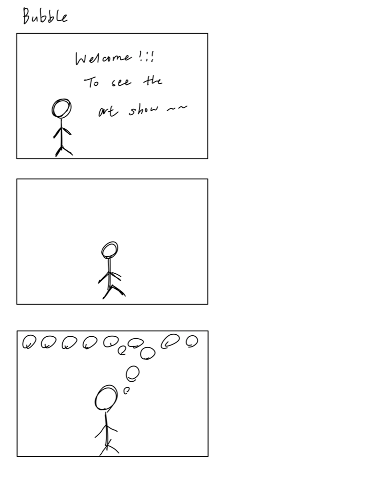
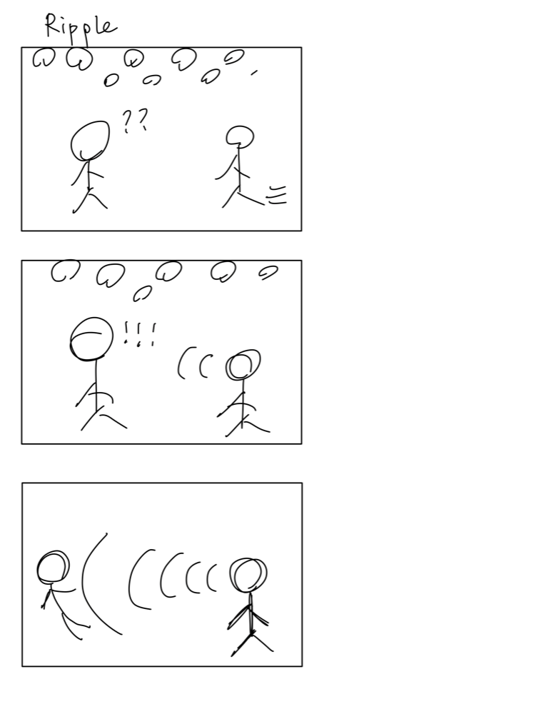
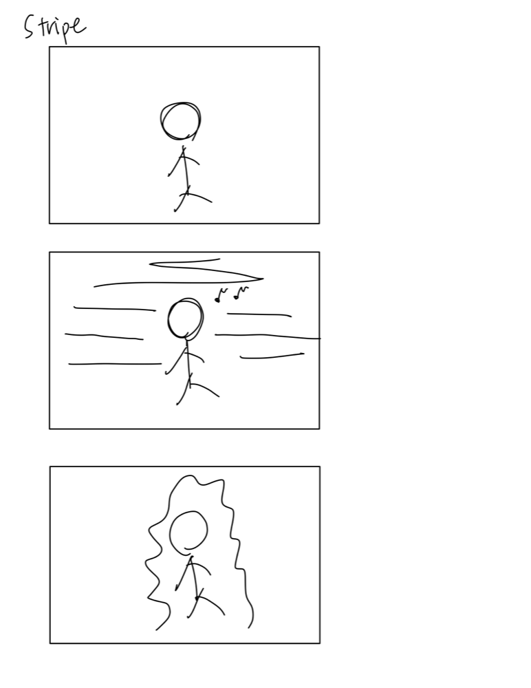
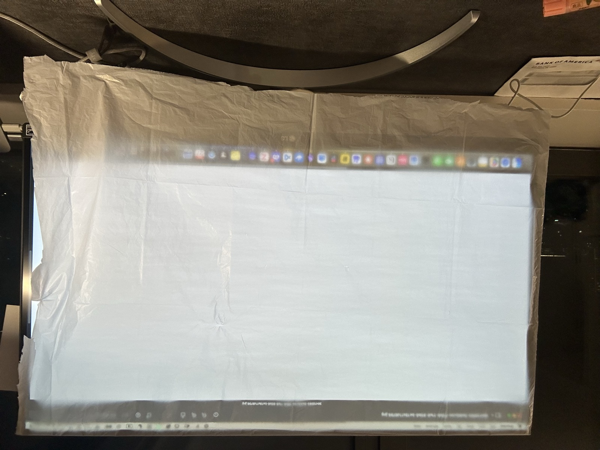
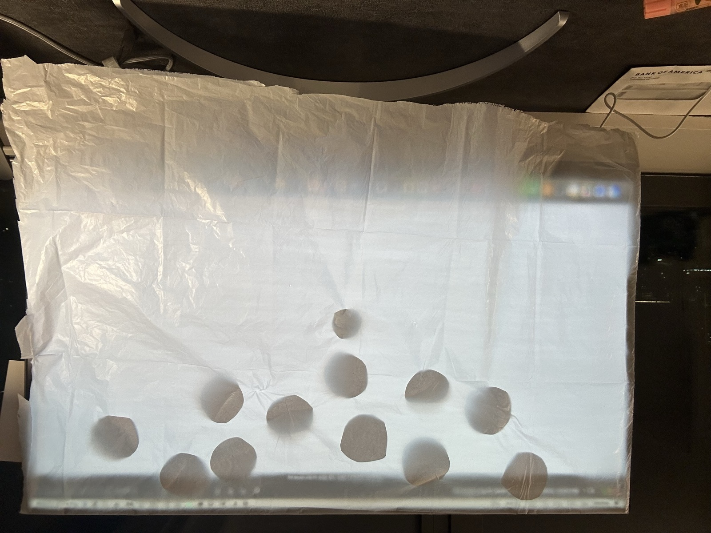

# Recreating the Masters of Interactive Light — *Messa di Voce*

**COLLABORATORS:** Tzu-Yi (Monica) Wei (tw628), Tzu-You (Regina) Chang (tc845)

**THE MASTERWORK WE DREW FROM THE HAT:** *Messa di Voce* (2003), Golan Levin & Zachary Lieberman

---

## Part 0. Know Your Master

*Messa di Voce* (2003), by Golan Levin and Zachary Lieberman. Performed by the voice artists Jaap Blonk and Joan La Barbara. First shown at Ars Electronica on 7 September 2003.

**Input / output:** The input is every vocal nuance, not the words. The output is "correspondingly complex, subtly differentiated and highly expressive graphics". A microphone reads the voice and a camera tracks the head, so the graphics look like they come out of the mouth. The show has 12 sections, for example Fluid, Ripple, Bounce and Stripes.

**Who is present:** Two performers, the screen and the audience. The performers talk to each other with sounds and the screen answers. The audience watches the sound instead of listening to it.

**Famous for, strengths and weaknesses:** It is famous because you can see sound. Everyone can make a sound, and the image comes at the same time, so the rule is clear. But it needs a very skilled performer, a dark room and a big screen.

**Core interaction:** A person makes a sound in front of a big screen, and shapes grow out of their mouth.

**Sources:** [flong.com](https://www.flong.com/archive/projects/messa/index.html) ｜ [ZKM](https://zkm.de/en/artwork/messa-di-voce-0)

## Part A. Plan

**Setting:** A dark room in an art museum, just before a show.

**Players:** Two performers and the audience. The first makes bubbles, the second makes ripples. The audience only watches.

**Activity:** The first performer makes a sound and bubbles float up. The second one comes in, and their ripples push the bubbles and the first performer away. Then the second one bows and it ends.

**Goals:** The first performer wants the stage. The second one wants to show it is not only for one sound. We want the audience to see that sound has a shape.

**Our three storyboards:**

We drew three versions, one for each kind of graphic. Bounce, Ripple and Stripes are all real section names in the original, so each version is a different way to show the same idea.

### Version 1 — Bubble

The performer makes a sound and round bubbles float up and fill the top of the screen.

### Version 2 — Ripple

A second person comes in. Their sound makes wide ripples that push the bubbles and the first performer away.

### Version 3 — Stripe

The performer sings and long horizontal lines appear across the screen. In the last frame the lines become an irregular shape that wraps around their body, so the person and the graphic become one thing.

**In the end we combined version 1 and version 2.**

**Feedback:**

*Messa di Voce* is not very well known, so the other group could not guess it. But after we told them, they could see it in the storyboards.

## Part B. Act out the Interaction

**Better on paper than in real life:**

The light. On paper we can draw any size and put it anywhere. In real life the light source decides if the shape is clear or not, and we did not think about that when we drew the storyboards. (Tests in Part C.)

**New ideas after acting it out:**

We thought this work was about what the shapes look like. It is really about how they appear. A paper bubble sitting on the cloth is nothing. It only works when it grows together with the sound.

The empty screen also matters. The audience needs to see an empty screen first, so they know the sound made the bubbles.

**Key moments that could go a different way:**

The moment the second person comes in. We had to decide what the second sound looks like. We chose ripples, but it could also be lines, or shapes around the person's body, which is what we drew in version 3. Ripples feel like sound moving through space. Lines feel like sound being recorded. Shapes on the body feel like the sound belongs to that person.

## Part C. Prototype the Light

We put cut paper on a sheet of translucent paper and lit it from behind. The paper blocks the light, so it becomes a dark shape.

The size of the light matters more than the brightness. We needed one big even light, not a small spot. We tried:

- **Phone:** too small. The lit area was a small spot and the edges were blurry.
- **Desk lamp:** bright enough, but it is a point light. Too bright near the lamp and too dark far from it.
- **Floor lamp:** a bigger area, but still uneven, and the colour was too yellow.

In the end we used a computer monitor at full brightness. A monitor is flat, so the light is even and the edges of the shapes are clean.

We also tried colours. Yellow and orange looked like a stage light, but this work is cold and digital. Blue and cyan lost too much contrast. White was the clearest, so we used white.

The lab says we can use a lamp instead of a phone if there are technical problems. We only decided this after we tested the phone.

## Part D. Wizard the Device

We shot two layers separately:

- **The light:** cut paper on the screen, lit by the monitor behind. We moved the paper by hand and took one photo at a time to make a stop-motion animation.
- **The performers:** filmed separately and added in editing.

We did not split the work. One person moved the paper and the other took the photo, and we swapped whenever we wanted. For the performance parts we filmed each other.

Setup photos are in Part E.

## Part E. Costume the Device

**Empty screen:**

**With the paper bubbles:**

Our setup is simple. A monitor shows a white image at full brightness, we taped translucent paper on top, and the cut paper goes on that.

We chose the bubbles and the ripples because they are the most famous images of this work. We did not try to copy all 12 sections.

Cut paper only works with big simple shapes. Thin lines get blurry after the light passes through the paper, so we kept the shapes very simple.

## Part F. Record

**[video_sketch.mp4](video_sketch.mp4)** — click the link to play it on GitHub.

**Collaborators:**

This lab was made by Tzu-Yi (Monica) Wei and Tzu-You (Regina) Chang. We did the storyboards, the paper cutting, the setup and the shooting together, and we filmed each other for the performance parts.

Information about the original work came from [flong.com](https://www.flong.com/archive/projects/messa/index.html) and [ZKM](https://zkm.de/en/artwork/messa-di-voce-0).

---

## Part 2 — ReMastering the light

*Week two.*
