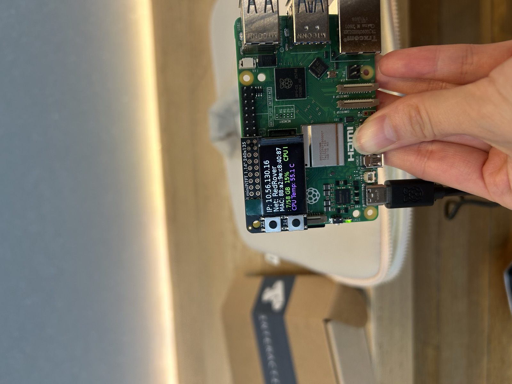
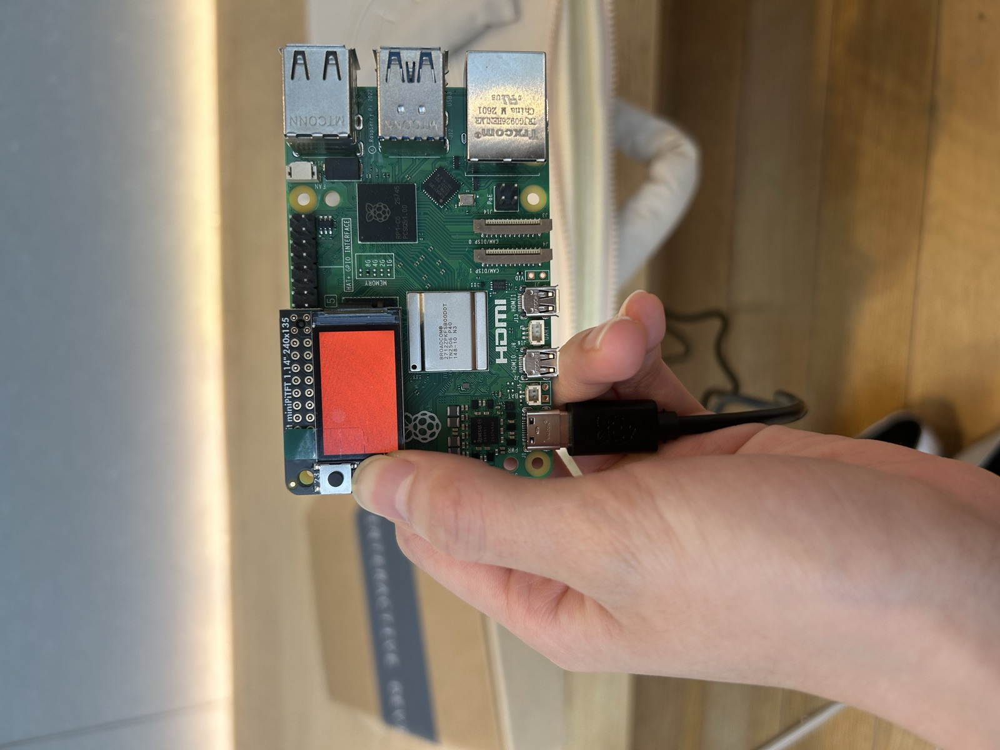
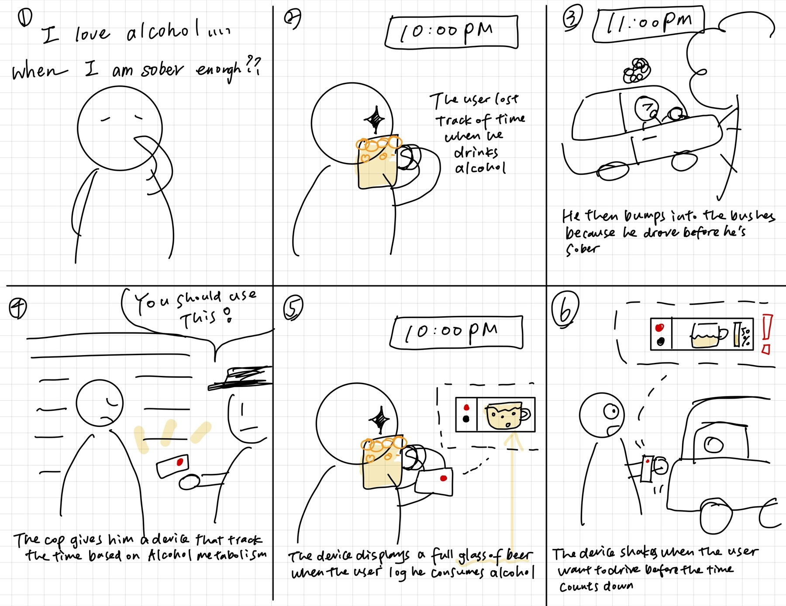
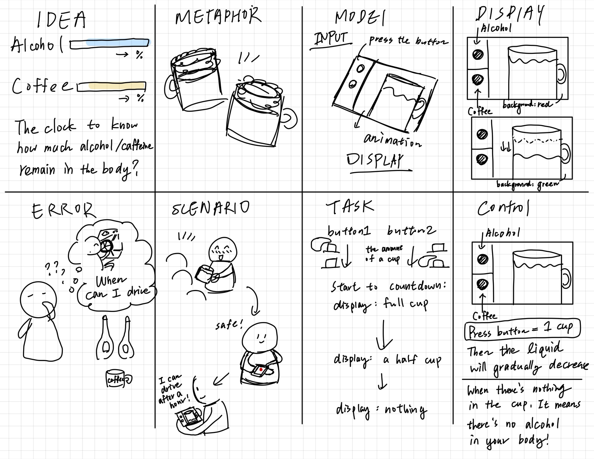
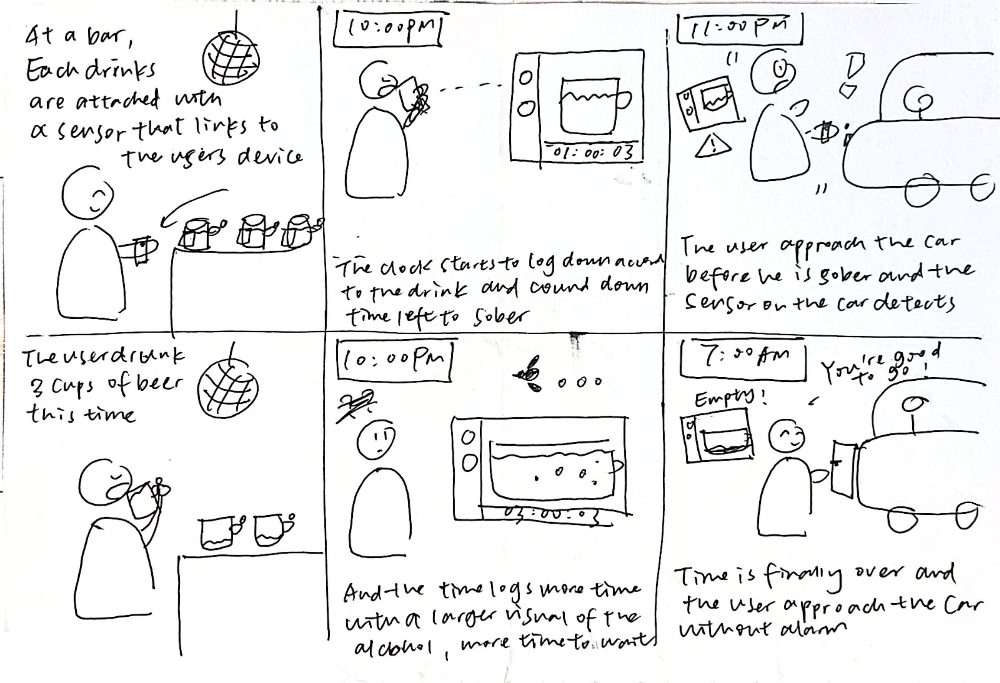

# Interactive Prototyping: The Clock of Pi
**Tzuyi (Monica) Wei (tw628), Aurora Jiaxin Shen(js3996)**

Does it feel like time is moving strangely during this semester?

For our first Pi project, we will pay homage to the [timekeeping devices of old](https://en.wikipedia.org/wiki/History_of_timekeeping_devices) by making simple clocks.

It is worth spending a little time thinking about how you mark time, and what would be useful in a clock of your own design.

**Please indicate anyone you collaborated with on this Lab here.**
Be generous in acknowledging their contributions! And also recognizing any other influences (e.g. from YouTube, Github, Twitter) that informed your design. 

## Prep

1. ### Set up your Lab 2 Github

At the start of lab Wednesday, ensure you have the latest lab content by updating your forked repository. 

**📖 [Follow the step-by-step guide for safely updating your fork](pull_updates/README.md)**

This guide covers how to pull updates without overwriting your completed work, handle merge conflicts, and recover if something goes wrong.


2. ### Get Kit and Inventory Parts
Take inventory of the kit parts that you have, and note anything that is missing:

***Update your [parts list inventory](partslist.md)***

3. ### Prepare your Pi for lab this week
[Follow these instructions](prep.md) to download and burn the image for your Raspberry Pi before lab Wednesday.


## Overview
For this assignment, you are going to 

A) [Connect to your Pi](#part-a)  

B) [Try out cli_clock.py](#part-b) 

C) [Set up your RGB display](#part-c)

D) [Try out clock_display_demo](#part-d) 

E) [Modify the code to make the display your own](#part-e)

F) [Make a short video of your modified barebones PiClock](#part-f)

G) [Sketch and brainstorm further interactions and features you would like for your clock for Part 2.](#part-g)

## The Report
This readme.md page in your own repository should be edited to include the work you have done. You can delete everything but the headers and the sections between the \*\*\***stars**\*\*\*. Write the answers to the questions under the starred sentences. Include any material that explains what you did in this lab hub folder, and link it in the readme.

Labs are due on Sunday midnight. Make sure this page is linked to on your main class hub page.

## Part A. 
### Connect to your Pi
Just like you did in the lab prep, ssh on to your pi. Once you get there, create a Python environment (named venv) by typing the following commands.

```
ssh pi@<your Pi's IP address>
...
pi@raspberrypi:~ $ python -m venv venv
pi@raspberrypi:~ $ source venv/bin/activate
(venv) pi@raspberrypi:~ $ 

```
### Setup Personal Access Tokens on GitHub
Set your git name and email so that commits appear under your name.
```
git config --global user.name "Your Name"
git config --global user.email "yourNetID@cornell.edu"
```

The support for password authentication of GitHub was removed on August 13, 2021. That is, in order to link and sync your own lab-hub repo with your Pi, you will have to set up a "Personal Access Tokens" to act as the password for your GitHub account on your Pi when using git command, such as `git clone` and `git push`.

Following the steps listed [here](https://docs.github.com/en/authentication/keeping-your-account-and-data-secure/managing-your-personal-access-tokens) from GitHub to set up a token. Depends on your preference, you can set up and select the scopes, or permissions, you would like to grant the token. This token will act as your GitHub password later when you use the terminal on your Pi to sync files with your lab-hub repo.


## Part B. 
### Try out the Command Line Clock
Clone your own lab-hub repo for this assignment to your Pi and change the directory to Lab 2 folder (remember to replace the following command line with your own GitHub ID):

```
(venv) pi@raspberrypi:~$ git clone https://github.com/<YOURGITID>/Interactive-Lab-Hub.git
(venv) pi@raspberrypi:~$ cd Interactive-Lab-Hub/Lab\ 2/
```
Depends on the setting, you might be asked to provide your GitHub user name and password. Remember to use the "Personal Access Tokens" you just set up as the password instead of your account one!

Check if the directory has clone sucessfully, you should see the Interactive-Lab-Hub under the home directory listed:
```
(venv) pi@raspberrypi:~ $ ls
Bookshelf      Documents            Music     Public                 venv
create_img.sh  Downloads            pi-apps   screen_boot_script.py  Videos
Desktop        Interactive-Lab-Hub  Pictures  Templates
(venv) pi@raspberrypi:~ $
```


Install the packages from the requirements.txt and run the example script `cli_clock.py`:

```
(venv) pi@raspberrypi:~/Interactive-Lab-Hub/Lab 2 $ pip install -r requirements.txt
(venv) pi@raspberrypi:~/Interactive-Lab-Hub/Lab 2 $ python cli_clock.py 
02/24/2021 11:20:49
```

The terminal should show the time, you can press `ctrl-c` to exit the script.
If you are unfamiliar with the Python code in `cli_clock.py`, have a look at [this Python refresher](https://hackernoon.com/intermediate-python-refresher-tutorial-project-ideas-and-tips-i28s320p). If you are still concerned, please reach out to the teaching staff!


## Part C. 
### Set up your RGB Display
We have asked you to equip the [Adafruit MiniPiTFT](https://www.adafruit.com/product/4393) on your Pi in the Lab 2 prep already. Here, we will introduce you to the MiniPiTFT and Python scripts on the Pi with more details.


The Raspberry Pi 5 has a variety of interfacing options. When you plug the pi in the red power LED turns on. Any time the SD card is accessed the green LED flashes. It has standard USB ports and HDMI ports. Less familiar it has a set of 20x2 pin headers that allow you to connect a various peripherals.


To learn more about any individual pin and what it is for go to [pinout.xyz](https://pinout.xyz/pinout/3v3_power) and click on the pin. Some terms may be unfamiliar but we will go over the relevant ones as they come up.

### Hardware (you have already done this in the prep)

From your kit take out the display and the [Raspberry Pi 5](https://www.google.com/url?sa=i&url=https%3A%2F%2Fwww.raspberrypi.com%2Fproducts%2Fraspberry-pi-5%2F&psig=AOvVaw330s4wIQWfHou2Vk3-0jUN&ust=1757611779758000&source=images&cd=vfe&opi=89978449&ved=0CBMQjRxqFwoTCPi1-5_czo8DFQAAAAAdAAAAABAE)

Line up the screen and press it on the headers. The hole in the screen should match up with the hole on the raspberry pi.

<p float="left">


</p>

### Testing your Screen

The display uses a communication protocol called [SPI](https://www.circuitbasics.com/basics-of-the-spi-communication-protocol/) to speak with the raspberry pi. We won't go in depth in this course over how SPI works. The port on the bottom of the display connects to the SDA and SCL pins used for the I2C communication protocol which we will cover later. GPIO (General Purpose Input/Output) pins 23 and 24 are connected to the two buttons on the left. GPIO 22 controls the display backlight.

To show you the IP and Mac address of the Pi to allow connecting remotely we created a service that launches a python script that runs on boot. For the following steps stop the service by typing ``` sudo systemctl stop piscreen.service --now```. Othwerise two scripts will try to use the screen at once. You may start it again by typing ``` sudo systemctl start piscreen.service --now```

We can test it by typing 
```
(venv) pi@raspberrypi:~/Interactive-Lab-Hub/Lab 2 $ python screen_test.py
```

You can type the name of a color then press either of the buttons on the MiniPiTFT to see what happens on the display! You can press `ctrl-c` to exit the script. Take a look at the code with
```
(venv) pi@raspberrypi:~/Interactive-Lab-Hub/Lab 2 $ cat screen_test.py
```

#### Displaying Info with Texts
You can look in `screen_boot_script.py` for how to display text on the screen!

#### Displaying an image

You can look in `image.py` for an example of how to display an image on the screen. Can you make it switch to another image when you push one of the buttons?

\*\*\***Include a picture of your own Raspberry Pi displaying the piscreen.service with your unique MAC address. Additionally, please provide another picture showing the successful completion of the screen test.**\*\*\*

**`piscreen.service` running on my Pi (hostname `strawberrypi`), showing my unique MAC address `88:a2:9e:c8:40:87`:**



**`screen_test.py` completed successfully. The display is filled with the color I typed (`red`) while holding button B:**




## Part D. 
### Set up the Display Clock Demo
Work on `screen_clock.py`, try to show the time by filling in the while loop (at the bottom of the script where we noted "TODO" for you). You can use the code in `cli_clock.py` and `stats.py` to figure this out.

### How to Edit Scripts on Pi
Option 1. One of the ways for you to edit scripts on Pi through terminal is using [`nano`](https://linuxize.com/post/how-to-use-nano-text-editor/) command. You can go into the `screen_clock.py` by typing the follow command line:
```
(venv) pi@raspberrypi:~/Interactive-Lab-Hub/Lab 2 $ nano screen_clock.py
```
You can make changes to the script this way, remember to save the changes by pressing `ctrl-o` and press enter again. You can press `ctrl-x` to exit the nano mode. There are more options listed down in the terminal you can use in nano.

Option 2. Another way for you to edit scripts is to use VNC on your laptop to remotely connect your Pi. Try to open the files directly like what you will do with your laptop and edit them. Since the default OS we have for you does not come up a python programmer, you will have to install one yourself otherwise you will have to edit the codes with text editor. [Thonny IDE](https://thonny.org/) is a good option for you to install, try run the following command lines in your Pi's ternimal:

  ```
  pi@raspberrypi:~ $ sudo apt install thonny
  pi@raspberrypi:~ $ sudo apt update && sudo apt upgrade -y
  ```

Now you should be able to edit python scripts with Thonny on your Pi.

Option 3. A nowadays often preferred method is to use Microsoft [VS code to remote connect to the Pi](https://www.raspberrypi.com/news/coding-on-raspberry-pi-remotely-with-visual-studio-code/). This gives you access to a fullly equipped and responsive code editor with terminal and file browser.  

Pro Tip: Using tools like [code-server](https://coder.com/docs/code-server/latest) you can even setup a VS Code coding environment hosted on your raspberry pi and code through a web browser on your tablet or smartphone! 

## Part E. Read Part 2. Sketch and brainstorm further interactions and features you would like for your clock.

One potential source of ideas might be thinking about other clocks and timekeeping devices for inspiration.

Another might be novel units of time. How do you measure a year? [In daylights? In midnights? In cups of coffee?](https://www.youtube.com/watch?v=wsj15wPpjLY)

We strongly discourage literal digital or analog clock display: Be creative.


** Insert ideas, sketches, [Verplank diagrams](https://ccrma.stanford.edu/courses/250a-fall-2004/IDSketchbok.pdf)), storyboards for your ideas **

### Idea: a clock that counts down what is still in your body

Instead of telling you what time it is, this clock tells you how much alcohol or
caffeine is still in your system. Time is measured in cups rather than in hours.
You log a drink with a button press, the screen fills with a full cup, and the
liquid level falls as your body metabolises it. An empty cup means you are clear
to drive.

#### Storyboard



#### Verplank diagram



| | |
|---|---|
| **Idea** | A clock to know how much alcohol / caffeine remains in the body. |
| **Metaphor** | A cup that slowly empties itself. |
| **Model** | Press a button to log a drink; the display animates the cup draining. |
| **Display** | Cup with a falling liquid level, red background for alcohol and green for caffeine. |
| **Error** | "When *can* I drive?" The moment of uncertainty the device removes. |
| **Task** | Button 1 and button 2 set the size of the cup, then the countdown runs: full cup → half cup → empty. |
| **Control** | One press = one cup. The liquid decreases on its own; nothing in the cup means nothing in your body. |


**feedback:**
Jianing Li: 
I think it's a really practical and interesting idea. You really drew a very clear Verplank diagram to show lots of specific and feasible information about you idea. I'm curious about how the clock measures the alcohol in your blood to ensure it's time limit warning precise? Or what is the mechanism behind your alcohol count down? Is it a fixed amount of time personalized according to your body data?

Johnathon: 
The idea is cool, I’d imagine the device as a wearable on my wrist so I can tap on it and see the visual feedback, sense vibrations directly. One question is the type of alcohol , is there any way to differentiate the type of drinks since different alcohol have different time of metabolism

Chih-Hsin Liu:
I really like this idea. Reframing time as “how much is still in my body” instead of “what hour is it”. It’s also actually useful.
The only concern I’d add is how you handle logging several drinks in a row. Will there be multiple cups shown on the screen, and will the countdown be extended?


# Lab 2 Part 2

## Prep 

1. Pick up remaining parts for kit on Wednesday lab class. Check the updated [parts list inventory](partslist.md) and let the TA know if there is any part missing.

2. Look at and give feedback on the Part E. for at least 3 other people in the class and get 3 people to comment on your Part E!)
**Put the feedback for your ideas here.**

## Update your Lab Hub

[Update your Lab Hub](pull_updates/README.md) to get the latest content and requirements for Part 2.

## Modify the barebones clock to make it your own

Start small, pick just one element of your overall idea, just to show you have a handle on the code and components.

\*\*\***Put a copy of your code in your Lab 2 Github repo.**\*\*\*

The one element we started with is the cup itself. Pressing a button logs a
drink and fills the cup; the liquid then drains on its own as the body
metabolises it, and an empty cup means you are clear. That is the whole idea in
miniature: time measured in cups rather than in hours.

The full script is [`cup_clock.py`](cup_clock.py). The state it keeps is the
heart of it:

```python
class CupState:
    def __init__(self, mode="ALCOHOL"):
        self.mode = mode
        self.left = {name: 0.0 for name in MODE_ORDER}

    @property
    def spec(self):
        return MODES[self.mode]

    @property
    def remaining(self):
        return self.left[self.mode]

    @remaining.setter
    def remaining(self, value):
        self.left[self.mode] = max(0.0, value)

    @property
    def alcohol_remaining(self):
        return self.left["ALCOHOL"]

    def add_serving(self):
        self.remaining += self.spec["clear_seconds"]

    def next_mode(self):
        self.mode = MODE_ORDER[(MODE_ORDER.index(self.mode) + 1) % len(MODE_ORDER)]

    def reset(self):
        self.remaining = 0.0

    def tick(self, elapsed):
        for name in self.left:
            self.left[name] = max(0.0, self.left[name] - elapsed * DEMO_SPEED)

    @property
    def fill(self):
        return min(self.remaining / self.spec["clear_seconds"], 1.0)

    @property
    def servings_left(self):
        return math.ceil(self.remaining / self.spec["clear_seconds"])

    def countdown(self, name=None):
        total = int(self.left[name] if name else self.remaining)
        return f"{total // 3600:01d}:{total // 60 % 60:02d}:{total % 60:02d}"
```

`DEMO_SPEED` at the top of the file runs the countdown 60x faster than real
metabolism, so a drink clears in a minute instead of an hour and the draining is
actually visible on video.

## Make a short video of your modified barebones PiClock

\*\*\***Take a video of your barely modified PiClock.**\*\*\*

[**demo1.mov**](demo1.mov) shows the cup filling on a button press and draining
down to empty on the MiniPiTFT.

After you edit and work on the scripts for Lab 2, the files should be upload back to your own GitHub repo! You can push to your personal github repo by adding the files here, commiting and pushing.

```
(venv) pi@raspberrypi:~/Interactive-Lab-Hub/Lab 2 $ git add .
(venv) pi@raspberrypi:~/Interactive-Lab-Hub/Lab 2 $ git commit -m 'your commit message here'
(venv) pi@raspberrypi:~/Interactive-Lab-Hub/Lab 2 $ git push
```

After that, Git will ask you to login to your GitHub account to push the updates online, you will be asked to provide your GitHub user name and password. Remember to use the "Personal Access Tokens" you set up in Part A as the password instead of your account one! Go on your GitHub repo with your laptop, you should be able to see the updated files from your Pi!

## Now, make your own PiClock

Do take advantage of having done the previous iteration to refine and simplify your design.

** Insert any updates ideas, sketches, [Verplank diagrams](https://ccrma.stanford.edu/courses/250a-fall-2004/IDSketchbok.pdf))!, storyboards for your ideas **

### Updated storyboard



### What we added: a warning at the car

The first version could only tell you how much alcohol was left in you. It
informed, but it could not intervene, and someone who has been drinking is
exactly the person least likely to check a screen. So this version watches the
moment that actually matters: reaching for the car.

A sensor on the door handle asks one question. Is a hand on it? If alcohol is
still counting down, the screen flashes `DON'T DRIVE` with the time remaining.
If the countdown has finished, the same touch answers `SAFE TO DRIVE`. The
device stops being a thing you consult and becomes a thing that stops you, which
is what it would take to keep a drunk driver off the road.

The warning reads the alcohol timer alone, whichever cup is on screen. Alcohol
and caffeine are counted separately and both drain at the same time, so a coffee
can be halfway through its own countdown without ever raising a warning.
Caffeine has no bearing on whether you may drive.

We intended to sense the handle with copper tape on an MPR121, so that simply
gripping the door would trigger it. Our MPR121 powered up but never answered on
the I2C bus, and swapping cables, ports and boards confirmed the sensor itself
was dead, so the demo uses a Qwiic button pressed by hand in its place. The code
looks for the MPR121 first and only falls back to the button when none is found,
so plugging in a working board restores the intended interaction with no change
to the script.

\*\*\***Put a copy of your code in your Lab 2 Github repo.**\*\*\*

[`cup_clock.py`](cup_clock.py) is the clock itself and
[`preview_cup_clock.py`](preview_cup_clock.py) renders it to a PNG so the layout
could be worked on away from the Pi.

<details>
<summary>Full source of <code>cup_clock.py</code></summary>

```python
import math
import random
import time

from PIL import Image, ImageDraw, ImageFont


DEMO_SPEED = 60

HANDLE_CHANNEL = 0

QWIIC_BUTTON_ADDRESS = 0x6F
QWIIC_BUTTON_STATUS = 0x03
QWIIC_BUTTON_PRESSED = 0x04

MODES = {
    "ALCOHOL": {
        "clear_seconds": 60 * 60,
        "liquid": (255, 176, 59),
        "background": (46, 6, 6),
        "accent": (231, 76, 60),
        "taper": 3,
        "foam": True,
        "ribs": True,
        "handle_width": 4,
    },
    "CAFFEINE": {
        "clear_seconds": 5 * 60 * 60,
        "liquid": (138, 84, 44),
        "background": (6, 33, 16),
        "accent": (46, 204, 113),
        "taper": 10,
        "foam": False,
        "ribs": False,
        "handle_width": 3,
    },
}
MODE_ORDER = list(MODES)

WIDTH, HEIGHT = 240, 135

PANEL_W = 60
CUP = {"left": 88, "right": 168, "top": 12, "bottom": 88}
HANDLE = {"left": 152, "right": 188, "top": 30, "bottom": 66}

FOAM_HEIGHT = 13
FOAM_COLOUR = (252, 249, 238)
FOAM_SHADOW = (223, 214, 190)
FOAM_HIGHLIGHT = (255, 255, 252)

_rng = random.Random(7)
FOAM_BUBBLES = [(_rng.uniform(0.04, 0.96), _rng.uniform(0.25, 0.95),
                 _rng.choice((0, 0, 0, 1)), _rng.random() < 0.35)
                for _ in range(44)]
RISING_BUBBLES = [(_rng.uniform(0.12, 0.88), _rng.random(),
                   _rng.choice((1, 1, 2))) for _ in range(10)]


def _cup_edges(y, taper):
    ratio = (y - CUP["top"]) / (CUP["bottom"] - CUP["top"])
    inset = taper * ratio
    return CUP["left"] + inset, CUP["right"] - inset


def _font(size, bold=False):
    candidates = [
        "/usr/share/fonts/truetype/dejavu/DejaVuSansMono-Bold.ttf" if bold
        else "/usr/share/fonts/truetype/dejavu/DejaVuSans.ttf",
        "/System/Library/Fonts/Menlo.ttc",
        "/System/Library/Fonts/Supplemental/Arial.ttf",
    ]
    for path in candidates:
        try:
            return ImageFont.truetype(path, size)
        except OSError:
            continue
    return ImageFont.load_default()


FONT_TIME = _font(22, bold=True)
FONT_WARN = _font(24, bold=True)
FONT_SMALL = _font(11)
FONT_TINY = _font(9)


class CupState:
    def __init__(self, mode="ALCOHOL"):
        self.mode = mode
        self.left = {name: 0.0 for name in MODE_ORDER}

    @property
    def spec(self):
        return MODES[self.mode]

    @property
    def remaining(self):
        return self.left[self.mode]

    @remaining.setter
    def remaining(self, value):
        self.left[self.mode] = max(0.0, value)

    @property
    def alcohol_remaining(self):
        return self.left["ALCOHOL"]

    def add_serving(self):
        self.remaining += self.spec["clear_seconds"]

    def next_mode(self):
        self.mode = MODE_ORDER[(MODE_ORDER.index(self.mode) + 1) % len(MODE_ORDER)]

    def reset(self):
        self.remaining = 0.0

    def tick(self, elapsed):
        for name in self.left:
            self.left[name] = max(0.0, self.left[name] - elapsed * DEMO_SPEED)

    @property
    def fill(self):
        return min(self.remaining / self.spec["clear_seconds"], 1.0)

    @property
    def servings_left(self):
        return math.ceil(self.remaining / self.spec["clear_seconds"])

    def countdown(self, name=None):
        total = int(self.left[name] if name else self.remaining)
        return f"{total // 3600:01d}:{total // 60 % 60:02d}:{total % 60:02d}"


def _wavy_surface(draw, x0, x1, y, colour, phase):
    points = [(x, y + 2.0 * math.sin((x / 9.0) + phase))
              for x in range(int(x0), int(x1) + 1)]
    draw.line(points, fill=colour, width=3)


def _draw_foam(draw, x0, x1, surface_y, phase):
    top = surface_y - FOAM_HEIGHT

    draw.rectangle((x0, top + 4, x1, surface_y), fill=FOAM_COLOUR)
    for index in range(int((x1 - x0) // 4) + 1):
        cx = x0 + 2 + index * 4
        radius = 4.2 + 1.4 * math.sin(index * 1.9 + phase * 0.25)
        draw.ellipse((cx - radius, top + 4 - radius, cx + radius, top + 4 + radius),
                     fill=FOAM_COLOUR)

    for rel_x, rel_y, radius, bright in FOAM_BUBBLES:
        bx = x0 + rel_x * (x1 - x0)
        by = top + 4 + rel_y * (FOAM_HEIGHT - 4)
        colour = FOAM_HIGHLIGHT if bright else FOAM_SHADOW
        draw.ellipse((bx - radius, by - radius, bx + radius, by + radius),
                     fill=colour)


def _draw_rising_bubbles(draw, level, base_y, taper, phase):
    if base_y - level < 6:
        return
    for rel_x, offset, radius in RISING_BUBBLES:
        progress = (phase * 0.04 + offset) % 1.0
        by = base_y - (base_y - level) * progress
        left, right = _cup_edges(by, taper)
        bx = left + 4 + rel_x * (right - left - 8)
        draw.ellipse((bx - radius, by - radius, bx + radius, by + radius),
                     fill=(255, 231, 178))


def _centre_text(draw, text, font, y, fill):
    left, _, right, _ = draw.textbbox((0, 0), text, font=font)
    draw.text(((WIDTH - (right - left)) / 2 - left, y), text, font=font, fill=fill)


def _draw_reach_response(draw, state, phase):
    if state.alcohol_remaining <= 0:
        draw.rectangle((0, 0, WIDTH, HEIGHT), fill=(4, 40, 20))
        draw.rectangle((3, 3, WIDTH - 4, HEIGHT - 4), outline=(46, 204, 113), width=3)
        _centre_text(draw, "SAFE TO DRIVE", FONT_WARN, 42, (46, 204, 113))
        _centre_text(draw, "no alcohol left", FONT_SMALL, 80, (150, 200, 170))
        return

    bright = int(phase * 0.85) % 2 == 0
    draw.rectangle((0, 0, WIDTH, HEIGHT),
                   fill=(214, 28, 28) if bright else (56, 2, 2))
    draw.rectangle((3, 3, WIDTH - 4, HEIGHT - 4),
                   outline=(255, 255, 255) if bright else (120, 10, 10), width=4)

    _centre_text(draw, "DON'T DRIVE", FONT_WARN, 34, (255, 255, 255))
    _centre_text(draw, state.countdown("ALCOHOL"), FONT_TIME, 68,
                 (255, 255, 255) if bright else (200, 120, 120))
    _centre_text(draw, "still in your body", FONT_SMALL, 100, (255, 210, 210))


def draw_frame(draw, state, phase=0.0, touching=False):
    if touching:
        _draw_reach_response(draw, state, phase)
        return

    spec = state.spec
    taper = spec["taper"]
    empty = state.remaining <= 0

    draw.rectangle((0, 0, WIDTH, HEIGHT), fill=spec["background"])

    for index, name in enumerate(MODE_ORDER):
        cy = 40 + index * 40
        active = name == state.mode
        pending = state.left[name] > 0
        accent = MODES[name]["accent"]
        colour = accent if active else (70, 70, 70)
        draw.ellipse((14, cy - 10, 34, cy + 10), fill=accent if active else None,
                     outline=colour, width=2)
        if pending and not active:
            dim = tuple(c // 3 for c in accent)
            draw.ellipse((19, cy - 5, 29, cy + 5), fill=dim)
        draw.text((40, cy - 6), name[0], font=FONT_SMALL,
                  fill=accent if active else (110, 110, 110))
    draw.line((PANEL_W, 10, PANEL_W, HEIGHT - 10), fill=(70, 70, 70), width=1)

    outline = (235, 235, 235)
    draw.arc((HANDLE["left"], HANDLE["top"], HANDLE["right"], HANDLE["bottom"]),
             start=-90, end=90, fill=outline, width=spec["handle_width"])

    if not empty:
        top_y = CUP["top"] + 3
        base_y = CUP["bottom"] - 3
        head = FOAM_HEIGHT if spec["foam"] else 0
        full_y = top_y + head + (3 if spec["foam"] else 0)
        level = max(base_y - (base_y - full_y) * state.fill, full_y)

        left_at_level, right_at_level = _cup_edges(level, taper)
        left_at_base, right_at_base = _cup_edges(base_y, taper)
        draw.polygon(
            [(left_at_level + 3, level), (right_at_level - 3, level),
             (right_at_base - 3, base_y), (left_at_base + 3, base_y)],
            fill=spec["liquid"],
        )

        if spec["ribs"]:
            for fraction in (0.22, 0.5, 0.78):
                rib_x = left_at_level + fraction * (right_at_level - left_at_level)
                draw.line((rib_x, level + 3, rib_x, base_y - 2),
                          fill=(255, 196, 104), width=1)

        if spec["foam"]:
            _draw_rising_bubbles(draw, level, base_y, taper, phase)
            _draw_foam(draw, left_at_level + 3, right_at_level - 3, level, phase)
        else:
            _wavy_surface(draw, left_at_level + 3, right_at_level - 3, level,
                          spec["liquid"], phase)

    draw.polygon(
        [(CUP["left"], CUP["top"]), (CUP["right"], CUP["top"]),
         (CUP["right"] - taper, CUP["bottom"]), (CUP["left"] + taper, CUP["bottom"])],
        outline=outline, width=3,
    )

    if state.servings_left > 1:
        draw.text((CUP["left"] + 8, CUP["top"] + 5), f"x{state.servings_left}",
                  font=FONT_SMALL, fill=(25, 25, 25))

    label = "CLEAR" if empty else state.countdown()
    colour = spec["accent"] if empty else (255, 255, 255)
    left, _, right, _ = draw.textbbox((0, 0), label, font=FONT_TIME)
    centre = PANEL_W + (WIDTH - PANEL_W) / 2
    draw.text((centre - (right - left) / 2 - left, CUP["bottom"] + 8),
              label, font=FONT_TIME, fill=colour)

    draw.text((PANEL_W + 8, HEIGHT - 12), "A mode    B +1 cup", font=FONT_TINY,
              fill=(120, 120, 120))


def _open_door_handle(i2c):
    try:
        import adafruit_mpr121
        pad = adafruit_mpr121.MPR121(i2c)[HANDLE_CHANNEL]
        print("door handle: MPR121 copper tape")
        return lambda: pad.value
    except (ImportError, ValueError, OSError, RuntimeError):
        pass

    try:
        from adafruit_bus_device.i2c_device import I2CDevice
        button = I2CDevice(i2c, QWIIC_BUTTON_ADDRESS)

        def pressed():
            buf = bytearray(1)
            with button:
                button.write_then_readinto(
                    QWIIC_BUTTON_STATUS.to_bytes(1, "little"), buf)
            return bool(buf[0] & QWIIC_BUTTON_PRESSED)

        pressed()
        print("door handle: Qwiic button (MPR121 not found)")
        return pressed
    except (ImportError, ValueError, OSError, RuntimeError):
        pass

    print("door handle: none found, warning disabled")
    return None


def main():
    import board
    import digitalio
    from adafruit_rgb_display import st7789

    cs_pin = digitalio.DigitalInOut(board.D5)
    dc_pin = digitalio.DigitalInOut(board.D25)
    disp = st7789.ST7789(
        board.SPI(),
        cs=cs_pin,
        dc=dc_pin,
        rst=None,
        baudrate=64000000,
        width=135,
        height=240,
        x_offset=53,
        y_offset=40,
    )

    backlight = digitalio.DigitalInOut(board.D22)
    backlight.switch_to_output()
    backlight.value = True

    button_a = digitalio.DigitalInOut(board.D23)
    button_b = digitalio.DigitalInOut(board.D24)
    button_a.switch_to_input()
    button_b.switch_to_input()

    handle = _open_door_handle(board.I2C())

    image = Image.new("RGB", (WIDTH, HEIGHT))
    draw = ImageDraw.Draw(image)
    state = CupState()

    was_a = was_b = False
    last = time.monotonic()
    phase = 0.0

    while True:
        now = time.monotonic()
        state.tick(now - last)
        last = now

        a, b = not button_a.value, not button_b.value
        if a and b:
            state.reset()
        elif a and not was_a:
            state.next_mode()
        elif b and not was_b:
            state.add_serving()
        was_a, was_b = a, b

        touching = handle() if handle is not None else False

        phase += 0.35
        draw_frame(draw, state, phase, touching=touching)
        disp.image(image, 90)
        time.sleep(0.05)


if __name__ == "__main__":
    main()
```

</details>

\*\*\***Take a video of your PiClock.**\*\*\*

[**final_video.MOV**](final_video.MOV) shows logging drinks, the cup draining, and
the DON'T DRIVE warning when the door handle is touched too early.


This lab was done together by Tzuyi (Monica) Wei (tw628) and Aurora Jiaxin Shen (js3996).

As always, make sure you document contributions and ideas from others (and AI) explicitly in your writeup.

You are permitted (but not required) to work in groups and share a turn in; you are expected to make equal contribution on any group work you do, and N people's group project should look like N times the work of a single person's lab.  Make sure the page for the group turn in is linked to your personal Interactive Lab Hub page. 


