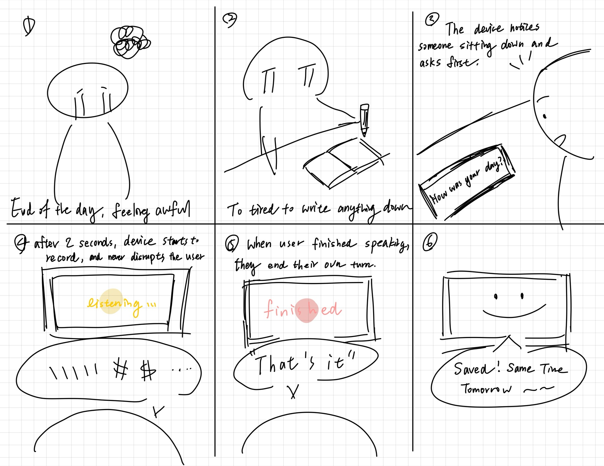

# Chatterboxes

**Tzuyi (Monica) Wei (tw628)**

[](https://youtu.be/LZ0VJClIlRI?si=Yy84mcyVYuVV19mn)

In this lab, we want you to design interaction with a speech-enabled device — something that listens and talks to you. This device can do anything *but* control lights (since we already did that in Lab 1). First, we want you to storyboard what you imagine the conversational interaction to be like. Then you will use wizarding techniques to elicit examples of what people might say, ask, or respond. We then want you to use the examples collected from at least two other people to inform the redesign of the device.

We will focus on **audio** as the main modality for interaction to start; these general techniques can be extended to **video**, **haptics** or other interactive mechanisms in the second part of the Lab.

A note on what you are building with. Speech interfaces are usually taught as two boxes — speech-in, speech-out — and that framing hides the part that actually determines whether an interaction works. Between listening and speaking sits the question of **whose turn it is**: when does the device decide you have finished talking, and how long does it make you wait before it answers? This lab gives you direct control over both, and we will ask you to notice what changes when you move them.

## Prep for Part 1: Get the Latest Content and Pick up Additional Parts

Please check instructions in [prep.md](prep.md) and complete the setup.

### Pick up Web Camera If You Don't Have One

Students who have not already received a web camera will receive their Webcam and at the beginning of lab. If you cannot make it to class this week, please contact the TAs to ensure you get these.

### Get the Latest Content

As always, pull updates from the class Interactive-Lab-Hub to both your Pi and your own GitHub repo.

**\[recommended\]** Option 1: On the Pi, `cd` to your `Interactive-Lab-Hub`, pull the updates from upstream (class lab-hub) and push the updates back to your own GitHub repo. You will need the *personal access token* for this.

```
pi@ixe00:~$ cd Interactive-Lab-Hub
pi@ixe00:~/Interactive-Lab-Hub $ git pull upstream Fall2026
pi@ixe00:~/Interactive-Lab-Hub $ git add .
pi@ixe00:~/Interactive-Lab-Hub $ git commit -m "get lab3 updates"
pi@ixe00:~/Interactive-Lab-Hub $ git push
```

Option 2: On your own GitHub repo, create a pull request to get updates from the class Interactive-Lab-Hub. After you have the latest updates online, go to your Pi, `cd` to your `Interactive-Lab-Hub` and use `git pull`.

---

# Part 1

## Setup

Create and activate a virtual environment for this lab:

```
pi@ixe00:~$ cd Interactive-Lab-Hub/Lab\ 3
pi@ixe00:~/Interactive-Lab-Hub/Lab 3 $ python3 -m venv .venv
pi@ixe00:~/Interactive-Lab-Hub/Lab 3 $ source .venv/bin/activate
(.venv) pi@ixe00:~/Interactive-Lab-Hub/Lab 3 $
```

Install the Python dependencies:

```
(.venv) $ pip install -r requirements.txt
```

This takes a few minutes. If you would like it to take considerably less time, [`uv`](https://docs.astral.sh/uv/) is a drop-in replacement for `pip` that is dramatically faster on the Pi:

```
(.venv) $ pip install uv && uv pip install -r requirements.txt
```

Then run the setup script, which installs the classic speech synthesizers, downloads the voice activity detection model, and pre-fetches a neural voice and a speech recognition model so you are not waiting on downloads during lab:

```
(.venv):~$ cd speech-scripts
(.venv) $ ./setup.sh
```

Check your audio devices before going further. `arecord -l` lists capture devices and `aplay -l` lists playback devices; if your webcam microphone or Bluetooth speaker does not appear, fix that first — every script below assumes the system defaults are the ones you want.

## A. Text to Speech

Your Pi can speak in several quite different ways, and the differences are audible in a way that matters for design. In `speech-scripts/` there are shell scripts for each.

### The classic engines

```
(.venv) $ cd speech-scripts

(.venv) $ sudo apt update
(.venv) $ sudo apt install -y espeak festival festvox-kallpc16k

(.venv) $ ./espeak_demo.sh
(.venv) $ ./festival_demo.sh
```

You can run these `.sh` files by typing `./filename`, and read one with `cat filename`. You can also play audio files directly with `aplay filename` — try `aplay lookdave.wav`.

These are all decades-old technology and they sound like it. `espeak-ng` is a *formant synthesizer*: it generates speech from an acoustic model of the vocal tract, which is why it sounds robotic but also why the whole thing fits in a couple of megabytes and responds instantly. `festival` is *concatenative*: they stitch together recorded fragments of a real speaker, which sounds more human but breaks audibly at the seams.

### Neural TTS with Piper

Note that the Piper command line changed in version 1.x — voices are now downloaded explicitly with `python3 -m piper.download_voices`, and you invoke it as `python3 -m piper`. Tutorials you find online may show the old `echo ... | piper --model ...` form, which no longer works. Browse the [voice samples](https://rhasspy.github.io/piper-samples) and download a different one if you'd like:

```
(.venv) $ python3 -m piper.download_voices en_US-lessac-medium
```

[Piper](https://github.com/OHF-Voice/piper1-gpl) synthesizes speech with a small neural network, runs comfortably on the Pi 5, and sounds markedly better than the above.

```
(.venv) $ ./piper_demo.sh
```

The demo script also shows `--output-raw`, which streams audio to the speaker as it is generated rather than writing a file first. Listen for the difference in how quickly speech begins. In a conversational system this gap is the thing your user experiences as responsiveness.

\*\***Write your own shell file to use your favorite of these TTS engines to have your Pi greet you by name.**\*\*
(This shell file should be saved to your own repo for this lab.)

[`greet.sh`](greet.sh). It says one line, "Good evening, Monica. How was your
day?", and takes the engine as an argument:

```bash
./greet.sh          # Piper, the one I chose
./greet.sh all      # the same line in every engine, back to back
./greet.sh espeak   # or festival, flite, piper
```

I wrote it this way because the demo scripts each say a different sentence, so
you cannot actually compare them. One sentence in four voices is comparable.

\*\***Then answer: Is the same greeting, in these different voices, the same greeting? Describe one concrete way the voice changed what the utterance seemed to mean or who seemed to be speaking.**\*\*

Only Piper sounded natural. espeak-ng, festival and flite were all choppy and
hard to make out, and all three sounded like a machine.

**Is it the same greeting?** Not for this device. "How was your day?" is asking
you to tell it something. When the words come out choppy you spend the whole
sentence working out what was said, and by the end nothing has been asked of
you, you have just been decoding. With Piper you hear the question the first
time.

A journal only works if the person answers it honestly, and that is hard to do
with a voice you have to decode first. So I use Piper, even though it is the
slowest of the four and waits a moment before it starts speaking.

## B. Speech to Text

We use [faster-whisper](https://github.com/SYSTRAN/faster-whisper), a reimplementation of OpenAI's Whisper model that runs several times faster on CPU and does not require PyTorch. All processing happens on the Pi; nothing is sent to a server.

```
(.venv) $ python transcribe.py lookdave.wav
```

The transcript is not the interesting output here — the timings are. Run it again with a larger model and compare:

```
(.venv) $ python transcribe.py lookdave.wav --model base.en
(.venv) $ python transcribe.py lookdave.wav --model small.en
#  noted that the first run may take longer because the model is downloaded, and that the HF unauthenticated-request warning is expected and not an error.
```

Available sizes, smallest first: `tiny.en`, `base.en`, `small.en`, `medium.en`. The `.en` variants are English-only and faster than their multilingual counterparts at the same size.

\*\***Record a few seconds of your own speech (`arecord -d 5 -f cd -c 1 -r 16000 test.wav`) and transcribe it with at least two model sizes. Report the real-time factor for each. At what point does the accuracy improvement stop being worth the delay, for a system that has to answer you?**\*\*

I ran the lab's file through three model sizes, then did the same with a
30 second recording of my own.

`lookdave.wav`, 3.72 seconds of clean studio speech:

| model | transcription | real-time factor |
|---|---|---|
| tiny.en | 1.04s | 0.28x |
| base.en | 2.19s | 0.59x |
| small.en | 5.83s | 1.56x |

All three returned exactly the same words. On this file the bigger models cost
5.6 times more and gave nothing back.

My own recording is a different story. It is 30 seconds of one person talking
quietly in a room with real pauses, which is what my device will actually hear.
The phrase to watch is "record a quick check-in before heading to bed".

| model | transcription | RTF | what it heard |
|---|---|---|---|
| tiny.en | 3.22s | 0.11x | "create a quick check in" |
| base.en | 6.01s | 0.20x | "cook or cook chicken" |
| small.en | 275.80s | 9.19x | correct, every word |

Only `small.en` got it right. On easy audio the model size bought me nothing. On
my own audio it was the only thing that worked.

Then look at the time. 275 seconds to transcribe 30 seconds of speech. Part of
that is the model and part of it is heat. Afterwards `vcgencmd get_throttled`
returned `0xe0000` and the Pi was at 74C, so it had already started slowing
itself down. I have no active cooler fitted. That number is not a clean
measurement of `small.en`, it is a measurement of `small.en` on a Pi that is
throttling. The honest reading is that the cost of a big model is not fixed. It
grows at exactly the moment you are asking the most of the machine.

Real-time factor is not a property of the model either. Every model looks faster
on my recording than on `lookdave.wav` because half of mine is silence and
silence is cheap.

**My answer:** for a device that has to answer you this is not a close call.
`small.en` is accurate and unusable. `tiny.en` answers in 3 seconds and gets
words wrong. I take `tiny.en` and design around the errors instead of paying for
them, which for a journal means putting the transcript on screen so the person
can see what it heard.

\*\***Write your own script that verbally asks for a numerical input (a phone number, zipcode, number of pets) and records the answer the respondent provides.**\*\* Numbers are a good stress test — transcription systems make characteristic errors on digit strings, and you will want to know what they are before you design around them.

[`ask_number.py`](ask_number.py). It asks the question through Piper, waits for
the answer using the same VAD as `listen.py`, transcribes it, and then says the
number back. Every answer is kept in `answers/` as a wav and a text file, so a
mistake can be looked at again instead of being remembered wrongly.

```bash
python ask_number.py
python ask_number.py --question "What is your phone number?"
```

It prints two things, what it heard and what it made of that. Two answers I
recorded:

```
question: How many pets do you have?
heard:    I have one.
digits:   1

question: What is your zip code?
heard:    1, 0, 0, 4, 4.
digits:   10044
```

Both were heard correctly. The zip code was spoken as five separate digits and
came back as five separate digits, so nothing was misheard. What did need
handling was the shape of it: Whisper wrote "1, 0, 0, 4, 4." with commas and a
full stop, which is not a zip code until the punctuation is taken out.

That is why the two columns are separate. Whisper is not consistent about how it
writes a number down, sometimes words and sometimes digits and sometimes a list,
and all of those have to end up as the same answer. Keeping the raw transcript
beside the parsed number tells you which kind of problem you have. Formatting is
fixable in code, which is all either of my answers needed. A genuinely misheard
digit is not, and has to be handled in the conversation instead, which is why the
script reads the number back before it stops.

I did not manage to make it mishear a digit in these two tries.

## C. Turn-taking: knowing when someone has stopped talking

Everything so far has worked on fixed audio files. A real conversational device does not get told when to start and stop recording — it has to decide. This is the problem that makes speech interfaces hard, and it is mostly not a speech recognition problem.

We use a **voice activity detector** (VAD) to segment the microphone stream into utterances. `listen.py` runs Silero VAD continuously and hands each detected utterance to faster-whisper:

```
(.venv) $ cd speech-scripts
(.venv) $ python listen.py
```

Speak, pause, and watch it transcribe. Now change the endpointing threshold — the amount of silence the system requires before it decides your turn is over:

```
(.venv) $ python listen.py --min-silence 0.2
(.venv) $ python listen.py --min-silence 1.5
```

\*\***Try both extremes, and something in between. Describe what each one feels like to talk to. Note specifically: at 0.2s, what kinds of normal speech get cut off? At 1.5s, what does the delay make the system seem like?**\*\*

Before describing how it feels I measured my own pauses. I recorded 30
seconds of reflective speech and ran it through the same Silero VAD that
`listen.py` uses. Half of the recording turned out to be silence.

Every pause in it, in seconds:

```
0.07  0.23  0.36  0.39  0.49  0.49  0.75  1.00  2.51  5.19
```

Median 0.49. Longest 5.19.

| `--min-silence` | pauses it reads as "you are done" | my 30 seconds becomes |
|---|---|---|
| 0.2s | 9 of 10 | 10 turns |
| 0.4s (default) | 6 of 10 | 7 turns |
| 0.8s | 3 of 10 | 4 turns |
| 1.5s | 2 of 10 | 3 turns |
| 3.0s | 1 of 10 | 2 turns |

There is a 5.19 second pause in there. It is the one where I stopped to think
about what the best part of the day had been. Nobody would ship a device that
waits 5 seconds before answering, so a device like this will always cut in on
that kind of pause.

Cutting costs accuracy as well. The same recording given to `tiny.en` three ways:

| | what came back |
|---|---|
| whole file | "taking a walk outside and you have to turn in" |
| one utterance at a time, the way `listen.py` does it | "The best part of my day was just..." / "taking a walk outside the afternoon." / "They're marrowers." |
| silence removed, kept as one stream | "taking a walk outside, near afternoon" |

The 0.7 second fragment came back as "They're marrowers", which is not anything.
A sentence split across two turns loses the words at the seam. Whisper works from
context and a fragment has none.

Removing the silence did not make it faster here, 3.22s for the whole 30 seconds
against 3.51s for the 16.9 seconds of speech. Whisper pads everything out to 30
second windows, so dropping 13 seconds of silence stayed inside the same single
window and bought nothing. It only pays when it takes you down a whole window.

So ending a turn too early does two kinds of damage at once. It interrupts the
person, and it makes the transcript worse.

**What gets cut off at 0.2s.** I put the recording back through the same VAD at
each setting and transcribed every turn it produced. At 0.2s one sentence, "I
felt a little busy but it's still such a wonderful day", came back as four
separate turns:

```
turn 4 [0.9s]  I felt
turn 5 [1.0s]  a little busy.
turn 6 [0.6s]  but...
turn 7 [2.0s]  do it such a wonderful day.
```

"but" is a turn on its own. So what gets cut is not the end of a sentence. It is
the small pause you make while you are picking the next word. At 0.4s it is the
same sentence and almost the same four pieces, and "a little busy" also comes
back as "a little bit".

At 1.5s the first 13.2 seconds hold together and read as one thought. That is
much better. But my two long pauses, 2.51s and 5.19s, are still longer than the
threshold, so the same reflection still arrives in three pieces.

**What 1.5s feels like to talk to.** Less slow than I expected. Waiting 1.5
seconds after you stop speaking is not the part you notice.

What you notice is what comes after it. One of my turns was 4.9 seconds of
speech and took 5.79 seconds to transcribe, so the real wait was over 7 seconds
and only 1.5 of those came from the threshold. The endpointing value is the
parameter the lab hands you, but it is not the whole delay, and on a Pi that is
already warm it is not even the larger half.

## D. Storyboard

Storyboard and/or use a Verplank diagram to design a speech-enabled device. (Stuck? Make a device that talks for dogs. If that is too stupid, find an application that is better than that.)

\*\***Post your storyboard and diagram here.**\*\*

A voice journal. It asks how your day was, and then it stays out of the way
while you answer.



The two screen states in panels 4 and 5 are the design. `listening...` means the
turn is still yours no matter how long you stop for. `finished` means the turn
has passed to the device. Nothing about the sound tells you which state you are
in, so the screen has to.

Write out what you imagine the dialogue to be. Use cards, post-its, or whatever method helps you develop alternatives or group responses.

\*\***Please describe and document your process.**\*\*

I measured first and designed afterwards, which turned out to be the right way
round.

The original plan was an ordinary voice assistant for journalling: it asks, you
answer, it endpoints, it replies. Then Part C gave me the pause data from my own
speech and that plan stopped making sense. The median pause is 0.49s but the
longest is 5.19s, and the long one was not the end of anything. It was the pause
where I was working out what the best part of the day had been, which is
exactly the sentence a journal exists to collect. Any threshold short enough to
feel responsive cuts that sentence in half.

So the device does not decide when your turn ends. You do. That is the one real
decision in the design and everything else follows from it:

- If the person ends the turn, the device needs to show that it is still
  listening during a long silence, or the silence just looks like it crashed.
  Hence `listening...` in panel 4.
- If the device is not endpointing, it needs some other way to start. Panel 3 is
  a proximity sensor: it notices someone sitting down and asks first, so the
  person never has to find a button to begin.
- The voice had to be Piper. From Part A, the other three engines make you decode
  the sentence before you can answer it, and a journal only gets honest answers.

The script, with the pauses written in, because they are choices and not
accidents:

| | who | what | pause after |
|---|---|---|---|
| 1 | device | "How was your day?" | 2.0s before it starts recording, so the question is not still hanging in the air while it listens |
| 2 | person | talks, stops, talks again | as long as they want, 5.19s was normal for me |
| 3 | person | "that's it" | - |
| 4 | device | shows the transcript | 1.5s, which is what transcription actually costs |
| 5 | device | "Saved. Same time tomorrow?" | ends |

The 1.5s in row 4 is measured, not guessed. In Part C one of my turns was 4.9
seconds of speech and took 5.79 seconds to transcribe, and a short sentence takes
closer to one or two. That wait has to be shown as thinking, or it reads as the
device having stopped.

One thing I cut. I wanted the device to say something about what you told it.
It says "Saved. Same time tomorrow?" instead. A journal is for putting something
down, not for being answered, and every reply I drafted sounded like it was
grading me.

## E. Acting out the dialogue

Find a partner, and *without sharing the script with your partner* try out the dialogue you've designed, where you (as the device designer) act as the device you are designing. Please record this interaction (for example, using Zoom's record feature).

\*\***Describe if the dialogue seemed different than what you imagined when it was acted out, and how.**\*\*

[**acting_out.mov**](acting_out.mov)

It went the way I imagined it. The part I was least sure about, the person
having to end their own turn, did not need explaining. They finished what they
were saying, the turn ended, and neither of us had to do anything to make that
happen.

The limit of the test is that a person was playing the device. Ending a turn in
front of someone who is visibly waiting for you is easy. Whether it stays that
easy when the thing across from you is a screen is the part this does not tell
me.


---

# Lab 3 Part 2

For Part 2, you will redesign the interaction with the speech-enabled device using the data collected, as well as feedback from part 1.

## Prep for Part 2

1. What are concrete things that could use improvement in the design of your device? For example: wording, timing, anticipation of misunderstandings.
2. What are other modes of interaction *beyond speech* that you might also use to clarify how to interact? In particular: how does someone know when the device is listening, and when it is thinking? You have a screen and an LED.
3. Make a new storyboard, diagram and/or script based on these reflections.
4. (optional) Integrate [input devices](inputs.md) in the system

**What needed improving.** Three things came out of Part 1.

The device never showed what it had heard. `tiny.en` turned "record a quick
check-in" into "create a quick check in", and nothing on screen would have let
anyone catch that.

Nothing told the person how to end their turn. In Part 1 a human was playing the
device, so it was obvious: you stop talking and the person in front of you
reacts. A box on a table gives you nothing to read.

The opening is always the same question. "How was your day?" is the wrong thing
to ask someone who has had a bad one, and the device has no way of knowing which
kind of day it is.

**Beyond speech.** The screen carries the two states, because the sound cannot.
A yellow dot breathing slowly means listening, and it keeps breathing through a
five second silence so that the pause does not read as a crash. A still red dot
means the turn has passed to the device. Then the transcript appears, which also
fixes the first problem above.

**What changed in the script.** Only the ending. In Part 1 the person said
"that's it" to a human who understood it. Here they press a button, which is the
same decision made in a form a device can actually receive.

## Prototype your system

The system should:
* use the Raspberry Pi
* use one or more sensors
* require participants to speak to it

*Document how the system works.*

*Include videos or screencaptures of both the system and the controller.*

[`journal.py`](journal.py) is the system. [`wizard.py`](wizard.py) can drive the
same states from a second terminal, kept as a fallback in case a button fails
during a session.

It uses two sensors and needs nobody operating it. The webcam notices someone
sitting down, and the buttons on the screen let that person act.

| state | what starts it | what the person sees |
|---|---|---|
| idle | nothing | a dim dot |
| asking | the webcam sees movement for 1.5s | "How was your day?", spoken by Piper |
| listening | 2 seconds after the question | a yellow dot breathing, and a counter |
| thinking | the person presses button B | a still red dot, "finished" |
| saved | the transcript comes back | the text, then "Saved. Same time tomorrow?" |

The camera is frame differencing rather than face detection. It pulls 160x120
grayscale frames from ffmpeg at 4fps and compares each one to the last. With
nobody in front of it the difference sits at 1.3, somebody sitting still reads 4
to 5, and somebody moving normally reads 13 to 38, so the trigger is at 6.

The device never endpoints. It will sit in `listening` for as long as the person
wants, which is the whole point of Part 1, and the turn ends when the person
presses the button.

Every entry is saved to `entries/` as a wav and a transcript.

## Test the system

Try to get at least two people to interact with your system. (Ideally, you would inform them that there is a wizard *after* the interaction, but I recognize that can be hard.)

Answer the following:

### What worked well about the system and what didn't?

From my own runs, before the sessions with other people:

The camera opening works. You sit down, it waits about a second and a half, and
it asks. Nobody has to find a button to begin, which was the point.

Whisper is the weak part. One entry came back as "It was a really nice day. It
was a really nice, nice, nice, nice day." The repetition is not in the audio. It
appears when the recording has quiet stretches, which a journal entry always
has, and showing the transcript on screen means the person sees it.

The camera also triggers on anything that moves, not only on someone sitting
down to use it. Walking past the desk is enough.

*(to fill in after the two sessions: whether they worked out how to end the
turn, and how long they waited before trying something)*

### What worked well about the controller and what didn't?

The controller is a single button, which is as small as this could be made.
Pressing it is unambiguous and it cannot be misheard, which is more than can be
said for anything else in this system.

What it does not do is explain itself. The button is the only part of the design
that the person has to be told about, and the screen never mentions it.

*(to fill in after the two sessions)*

### What lessons can you take away from the WoZ interactions for designing a more autonomous version of the system?

The Part 1 wizarding session is the reason this version has a button at all.
Acting it out with a person showed that ending a turn is effortless when someone
is visibly waiting for you, and that none of that carries over to a box. A human
wizard hides the hardest problem instead of solving it, because the wizard reads
things off the person that the device has no access to.

So the lesson is about what to automate and what not to. Part C showed that
automatic endpointing cannot work for reflective speech at any threshold, and
wizarding showed that a human does it without effort. A more autonomous version
should not try to close that gap by guessing better. It should keep the decision
with the person and spend the effort on making the invitation obvious, which is
the part that is actually still missing.

### How could you use your system to create a dataset of interaction? What other sensing modalities would make sense to capture?

It already makes one. Every session writes a wav and a transcript to `entries/`,
so what accumulates is paired audio and text of people talking about their day in
a room, with the pauses left in. Pauses are the thing most speech datasets throw
away, and they are exactly what I needed in Part C.

What is missing is the timing around the speech. The useful thing to log next
would be the moment the button was pressed relative to the last word, because
that is a direct measurement of the gap an automatic system would have to guess:
how long after someone stops talking do they consider themselves finished. A few
dozen of those would say more than any threshold I could pick by hand.

The camera is already running and only its frame difference is used. Keeping a
low rate record of that would say whether people look at the screen while they
talk, which would tell me whether the breathing dot is doing anything at all.

<details>
  <summary><strong>Submission Cleanup Reminder (Click to Expand)</strong></summary>

  **Before submitting your README.md:**
  - This readme.md file has a lot of extra text for guidance.
  - Remove all instructional text and example prompts from this file.
  - You may either delete these sections or use the toggle/hide feature in VS Code to collapse them for a cleaner look.
  - Your final submission should be neat, focused on your own work, and easy to read for grading.
</details>
